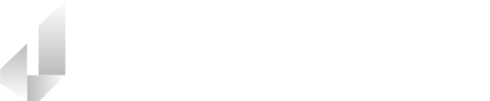

# 🚀 Welcome to Jaegersoft
Jaegersoft is an Australian team of passionate, expert software engineers specialising in bespoke software development. We help businesses from pre-seed start-ups to billion-dollar enterprises build cutting-edge software solutions tailored to their unique needs.

## 💡 Who We Work With
We collaborate with businesses across a variety of industries, including:
✔️ Advanced Manufacturing
✔️ Mining & Heavy Industry
✔️ Mechanical & Electrical Engineering
✔️ Finance & FinTech
✔️ Construction & Industrial Processing

## 🔧 Our Expertise
We provide full-spectrum software development services, from ideation to deployment, ensuring scalability, security, and performance.

### Core Services
🔹 Custom Web & Mobile App Development
🔹 Cloud-Native & Scalable Solutions
🔹 Industrial IoT & Automation Software
🔹 AI, Data Analytics & Machine Learning
🔹 DevOps, CI/CD & Infrastructure as Code

### Tech Stack
Our engineers are skilled in a diverse range of technologies, including (but not limited to):
🔹 Frontend: React, React Native, Blazor Pages, Flutter, MAUI
🔹 Backend: .NET, Node.js, Python, Rust
🔹 Cloud & DevOps: AWS, Azure, Docker, Kubernetes, Terraform
🔹 Databases: MongoDB, PostgreSQL, Azure SQL, InfluxDB, CosmosDB, DynamoDB 

## 🤝 Work With Us
Have an idea or need a custom software solution? Let's build it together.

📧 **Contact us:** admin@jaegersoft.com
🌐 **Website:** jaegersoft.com
🔗 **LinkedIn:** linkedin.com/company/jaegersoft
